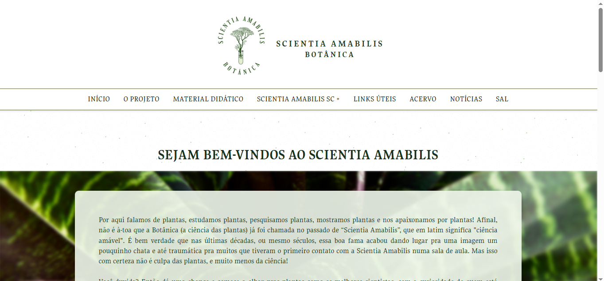
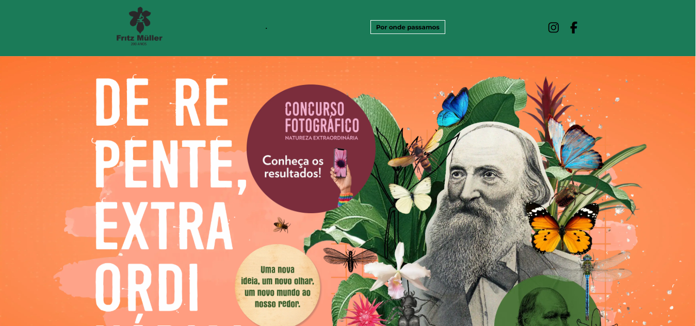
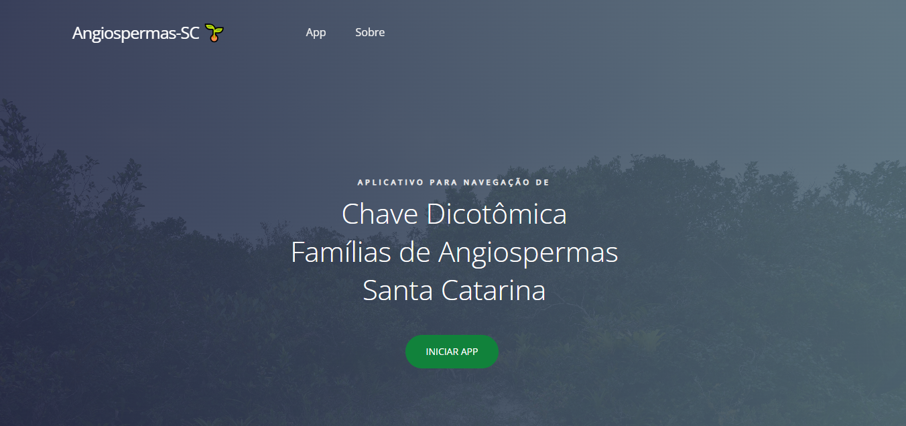
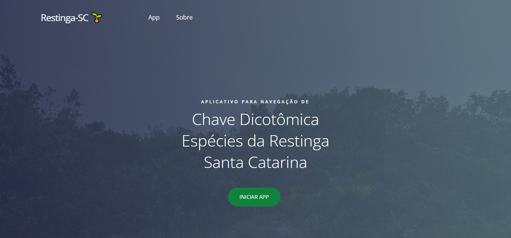
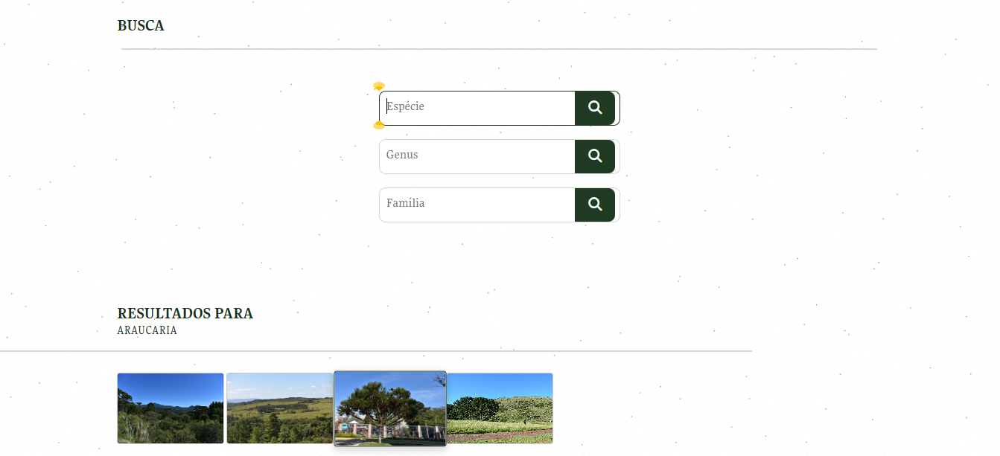

<table>
  <tr>
    <td align="center" width="50%">
      <h3>🔬 Scientia Amabilis</h3>
      
      
Plataforma desenvolvida para o projeto <b>Scientia Amabilis</b> do departamento de Biologia da UFSC, reunindo informações e recursos relacionados às atividades do projeto.

    </td>
    <td align="center" width="50%">
      <h3>🖼️ De Repente, Extraordinária!</h3>
      
      
Reativação e disponibilização do site de divulgação da exposição <b>De Repente, Extraordinária!</b>, vinculada à Universidade Federal de Santa Catarina (UFSC).

    </td>
  </tr>
  <tr>
    <td align="center" width="50%">
      <h3>🌿 Famílias de Angiospermas</h3>
      
      
Aplicação web voltada à identificação e consulta de famílias de angiospermas de Santa Catarina, disponibilizando informações para apoio à identificação botânica.

    </td>
    <td align="center" width="50%">
      <h3>🌱 Angiospermas da Restinga</h3>
      
      
App web destinada à consulta e identificação de espécies de angiospermas da restinga catarinense, para auxiliar estudos e atividades de identificação botânica.

    </td>
  </tr>  
  <tr>
    <td colspan="2" align="center">
      <h3>🗃️ Banco de Dados — Vegetação e Flora de Santa Catarina</h3>
      

        Página integrada à plataforma <b>Scientia Amabilis</b>, com consulta
        ao banco de dados de vegetação e flora de Santa Catarina. Permite
        realizar buscas por <b>espécie, gênero ou família</b> e visualizar
        os registros encontrados.
      

            
    </td>
  </tr>
</table>
